# Plugins da Suíte CafeEngine

Este documento lista e descreve os plugins que compõem a suíte CafeEngine, detalhando suas funcionalidades, categorias e dependências. Todos os plugins são construídos sob a filosofia da Programação Orientada a Resources (ROP), onde `Resources` são tratados como entidades ativas e inteligentes.

```mermaid
graph TD
    ResourceEditor --> BlueprintEditor
    ResourceEditor --> StateMachine
    ResourceEditor --> DataBehavior
    ResourceEditor --> EventPulse
    ResourceEditor --> AudioBlend
    ResourceEditor --> VFXEcho
    ResourceEditor --> EnvironmentBlend
    ResourceEditor --> CameraRig
    ResourceEditor --> UIFrame
    ResourceEditor --> ProgressionSystem
    ResourceEditor --> AIMind
    ResourceEditor --> CombatSystem
    ResourceEditor --> InteractionThread
    ResourceEditor --> ItemPool
    ResourceEditor --> AssetInstance
    ResourceEditor --> WorldAtlas

    StateMachine --> AIMind
    StateMachine --> CombatSystem
    StateMachine --> InteractionThread
    StateMachine --> CameraRig

    DataBehavior --> AIMind
    DataBehavior --> CombatSystem
    DataBehavior --> InteractionThread
    DataBehavior --> ItemPool
    DataBehavior --> AssetInstance
    DataBehavior --> WorldAtlas
    DataBehavior --> UIFrame
    DataBehavior --> ProgressionSystem

    EventPulse --> AudioBlend
    EventPulse --> VFXEcho
    EventPulse --> EnvironmentBlend
    EventPulse --> CameraRig
    EventPulse --> InteractionThread
    EventPulse --> CombatSystem
    EventPulse --> UIFrame
    EventPulse --> ProgressionSystem
    EventPulse --> AIMind
```

---

## 1. Categoria: Infraestrutura e Ferramentas de Editor

### 1.1. ResourceEditor
*   **Funcionalidades:** Atua como a infraestrutura fundamental da CafeEngine, fornecendo classes base, utilitários essenciais e estabelecendo padrões de integração, comunicação e gerenciamento. Inclui o `ResourcePanel` (host unificado para SidePanels) e o `ResourceTopPanel` (editor universal de Resources).
*   **Dependências Essenciais:** Nenhuma (é a base da suíte).
*   **Dependências Opcionais:** Nenhuma.
*   **Dependentes:** BlueprintEditor, StateMachine, DataBehavior, EventPulse, AudioBlend, VFXEcho, EnvironmentBlend, CameraRig, UIFrame, ProgressionSystem, AIMind, CombatSystem, InteractionThread, ItemPool, AssetInstance, WorldAtlas (Todos os plugins da Suite).

### 1.2. BlueprintEditor
*   **Funcionalidades:** Oferece um editor visual/NoCode de alto nível, baseado em grafos, para construir e gerenciar a lógica de jogo. Orquestra `Resources` da ROP e serve como um host genérico para Módulos CrossPlugin de outros plugins.
*   **Dependências Essenciais:** `ResourceEditor`.
*   **Dependências Opcionais:** Nenhuma.
*   **Módulos de Integração Opcionais:** `StateMachine` (para o `StateBlue`), `DataBehavior` (para o `DataMaker`), `EventPulse` (para o `EventFlow`), `AIMind` (para o `AIBuild`) (plugins que podem se integrar ao BlueprintEditor para visualização).

---

## 2. Categoria: Comportamento e Lógica

### 2.1. StateMachine
*   **Funcionalidades:** Framework avançado para Máquina de Estados Paralela e em Camadas. O `StateComponent` gerencia `StateBehavior`s ativos simultaneamente em diferentes domínios. `StateBehavior`s encapsulam a lógica de um domínio funcional. O `StateMachine` (Autoload) gerencia estados globais do jogo e auxilia na depuração.
*   **Dependências Essenciais:** `ResourceEditor`.
*   **Dependências Opcionais:** `BlueprintEditor` (para visualização de grafos), `DataBehavior` (para `DataResource`s em `StateBehavior`s).
*   **Dependentes:** AIMind, CombatSystem, InteractionThread, CameraRig.

### 2.2. EventPulse
*   **Funcionalidades:** Permite a criação e gerenciamento de **eventos de jogo configuráveis** (ex: "inimigo derrotado", "item coletado", "área descoberta") e suas **reações encadeadas**. Oferece uma interface visual para definir **triggers** (condições que disparam eventos) e **ações** (lógica executada em resposta a eventos), facilitando a construção de sequências de eventos e reações complexas no jogo. Não atua como um barramento de eventos genérico para comunicação entre plugins, mas sim como um orquestrador de lógicas de jogo baseadas em eventos específicos.
*   **Dependências Essenciais:** `ResourceEditor`.
*   **Dependências Opcionais:** `BlueprintEditor` (para editor visual de triggers e ações), `StateMachine` (para eventos baseados em estado).
*   **Dependentes:** AudioBlend, VFXEcho, EnvironmentBlend, CameraRig, InteractionThread, CombatSystem, UIFrame, ProgressionSystem, AIMind.

### 2.3. AIMind
*   **Funcionalidades:** Gerencia comportamentos de Inteligência Artificial, incluindo tomada de decisão, padrões de ataque, patrulha, perseguição e outras lógicas de IA, configuráveis via `Resources`.
*   **Dependências Essenciais:** `ResourceEditor`.
*   **Dependências Opcionais:** `StateMachine` (para estados de IA), `DataBehavior` (para dados de IA), `BlueprintEditor` (para visualização de IA).
*   **Dependentes:** Nenhuma.

### 2.4. CombatSystem
*   **Funcionalidades:** Gerencia a lógica de combate, incluindo ataques corpo a corpo e à distância, defesa, reações a dano e sistemas de habilidades, tudo configurável através de `Resources`.
*   **Dependências Essenciais:** `ResourceEditor`.
*   **Dependências Opcionais:** `StateMachine` (para estados de combate), `DataBehavior` (para dados de armas/habilidades), `VFXEcho` (para efeitos visuais de combate), `AudioBlend` (para sons de combate).
*   **Dependentes:** Nenhuma.

### 2.5. InteractionThread
*   **Funcionalidades:** Gerencia sequências de interação com objetos no mundo, como diálogos, cutscenes interativas e eventos contextuais, utilizando um fluxo modular baseado em `Resources`.
*   **Dependências Essenciais:** `ResourceEditor`.
*   **Dependências Opcionais:** `StateMachine` (para estados de interação), `DataBehavior` (para dados de interação/diálogo), `EventPulse` (para triggers de interação).
*   **Dependentes:** Nenhuma.

---

## 3. Categoria: Gerenciamento de Dados e Assets

### 3.1. DataBehavior
*   **Funcionalidades:** Serve como a base para a definição e gerenciamento de dados e comportamentos de entidades (ex: `CharacterData`, `WeaponData`), todos implementados como `Resources`.
*   **Dependências Essenciais:** `ResourceEditor`.
*   **Dependências Opcionais:** `StateMachine` (para `StateBehavior`s que usam `DataResource`s), `BlueprintEditor` (para visualização de dados).
*   **Dependentes:** AIMind, CombatSystem, InteractionThread, ItemPool, AssetInstance, WorldAtlas, UIFrame, ProgressionSystem.

### 3.2. ItemPool
*   **Funcionalidades:** Gerencia `Resources` que representam itens, como os de inventário ou coletáveis pelo jogador, otimizando a criação e reutilização.
*   **Dependências Essenciais:** `ResourceEditor`.
*   **Dependências Opcionais:** `DataBehavior` (para dados de itens).
*   **Dependentes:** Nenhuma.

### 3.3. WorldAtlas
*   **Funcionalidades:** Gerencia dados do mundo do jogo, como mapas, biomas, e pode incluir funcionalidades para geração procedural de terreno e estruturação de ambientes.
*   **Dependências Essenciais:** `ResourceEditor`.
*   **Dependências Opcionais:** `AssetInstance` (para popular o mundo), `DataBehavior` (para dados de biomas/terreno).
*   **Dependentes:** Nenhuma.

### 3.4. AssetInstance
*   **Funcionalidades:** Gerencia `Resources` que representam objetos e instâncias de assets (props, cenas) para geração procedural e para fornecer uma base de assets/cenas pré-configuradas no jogo.
*   **Dependências Essenciais:** `ResourceEditor`.
*   **Dependências Opcionais:** `WorldAtlas` (para geração procedural), `DataBehavior` (para dados de assets).
*   **Dependentes:** Nenhuma.

---

## 4. Categoria: Sistemas de Mídia e Feedback

### 4.1. AudioBlend
*   **Funcionalidades:** Otimiza o fluxo de trabalho de gerenciamento de áudio, automatizando a criação de `AudioStreamPlaylist`, `AudioStreamRandomizer` e `AudioStreamSynchronized` a partir de arquivos brutos. Organiza todos os recursos de áudio em um `AudioManifest` centralizado.
*   **Dependências Essenciais:** `ResourceEditor`.
*   **Dependências Opcionais:** `StateMachine` (para reagir a sinais de estado), `EventPulse` (para eventos de áudio).
*   **Dependentes:** Nenhuma.

### 4.2. VFXEcho
*   **Funcionalidades:** Gerencia efeitos visuais (partículas, shaders, etc.), com foco em efeitos que podem ser repetidos, ressoados ou encadeados, configuráveis via `Resources`.
*   **Dependências Essenciais:** `ResourceEditor`.
*   **Dependências Opcionais:** `EventPulse` (para disparar VFX), `CombatSystem` (para VFX de combate).
*   **Dependentes:** Nenhuma.

### 4.3. EnvironmentBlend
*   **Funcionalidades:** Gerencia transições e misturas dinâmicas entre diferentes ambientes, permitindo efeitos visuais, sonoros ou de jogabilidade baseados em `Resources`.
*   **Dependências Essenciais:** `ResourceEditor`.
*   **Dependências Opcionais:** `VFXEcho` (para efeitos visuais), `AudioBlend` (para efeitos sonoros).
*   **Dependentes:** Nenhuma.

### 4.4. CameraRig
*   **Funcionalidades:** Controla a câmera do jogo, incluindo transições suaves, efeitos dinâmicos (como shake e tilt) e perfis de câmera configuráveis via `Resources`.
*   **Dependências Essenciais:** `ResourceEditor`.
*   **Dependências Opcionais:** `StateMachine` (para estados de câmera), `EventPulse` (para eventos de câmera).
*   **Dependentes:** Nenhuma.

---

## 5. Categoria: Interface de Usuário (UI)

### 5.1. UIFrame
*   **Funcionalidades:** Fornece uma estrutura e base modular para a interface do usuário, incluindo componentes reutilizáveis, temas e layouts, tudo gerenciado por `Resources`.
*   **Dependências Essenciais:** `ResourceEditor`.
*   **Dependências Opcionais:** `DataBehavior` (para dados de UI), `EventPulse` (para eventos de UI).
*   **Dependentes:** Nenhuma.

---

## 6. Categoria: Progressão e Fluxo de Jogo

### 6.1. ProgressionSystem
*   **Funcionalidades:** Gerencia a progressão do jogador, incluindo sistemas de níveis, experiência, desbloqueio de habilidades e conquistas, configuráveis via `Resources`.
*   **Dependências Essenciais:** `ResourceEditor`.
*   **Dependências Opcionais:** `DataBehavior` (para dados de progressão), `EventPulse` (para eventos de progressão).
*   **Dependentes:** Nenhuma.
